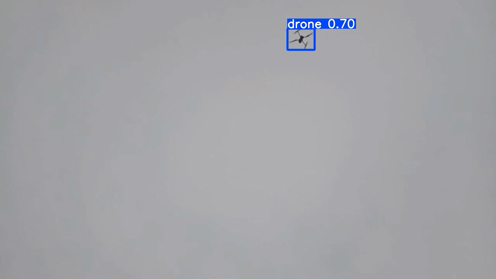

# 🚁 Drone Detection with YOLOv8

A custom-trained YOLOv8 object detection system for detecting drones and related objects in images and videos.

## 📌 Project Overview

This project implements a custom YOLOv8 object detection model trained on a dataset obtained from Roboflow.

The trained model was used for object detection on both images and videos, with the ability to save detection results.

The main goal of this project was to develop a practical computer vision system capable of detecting drone-related objects using a custom-trained deep learning model.

---

## 🎯 Project Highlights

- Custom-trained YOLOv8 model
- 14,166-image dataset
- 4 object detection classes
- Image and video detection
- Custom model training
- Real-world video inference
- Detection results saved for further analysis

---

## 📊 Dataset

The dataset was obtained from Roboflow and contains **14,166 images**.

### Classes

The dataset contains four classes:

- `0`
- `1`
- `drone`
- `not drone`

### Dataset Split

The dataset was organized into:

```text
train/
valid/
test/
```

---

## 🤖 Model

| Property | Value |
|---|---|
| Model | YOLOv8 |
| Task | Object Detection |
| Dataset | Roboflow |
| Images | 14,166 |
| Classes | 4 |
| Image Size | 640 × 640 |
| Confidence Threshold | 0.20 |
| Training | Custom Training |

---

## 📈 Model Performance

The trained model achieved the following results:

| Metric | Score |
|---|---:|
| Precision | **91.0%** |
| Recall | **80.1%** |
| mAP@50 | **83.6%** |

### Performance Summary

The model achieved a precision of **91.0%**, meaning that most of its positive detections were correct.

The **80.1% recall** indicates that the model successfully detected a large portion of the target objects.

The model achieved an **mAP@50 of 83.6%** on the evaluation data.

> Note: Object detection performance is reported using Precision, Recall, and mAP@50 rather than classification accuracy.

---

## 🎥 Detection Demo

### Example Detection Result



### Video Demo

The trained YOLOv8 model was also tested on video.

[▶️ Watch YOLOv8 Detection Demo](https://github.com/HADi-Shahrivary/drone-detection-yolov8/raw/refs/heads/main/drone-detection-demo.mp4)

---

## 💻 Inference

The trained model can be loaded using the Ultralytics YOLO API:

```python
from ultralytics import YOLO

# Load the trained YOLOv8 model
model = YOLO("best.pt")

# Run inference on a video
results = model.predict(
    source="video 5.mp4",
    show=True,
    save=True,
    conf=0.2,
    imgsz=640
)

print("Detection completed successfully.")
```

---

## 🛠️ Technologies

- Python
- YOLOv8
- Ultralytics
- PyTorch
- OpenCV
- Roboflow

---

## 📁 Repository Structure

```text
drone-detection-yolov8/
│
├── README.md
├── predict.py
├── requirements.txt
├── dron.png
└── drone-detection-demo.mp4
```

> The trained `best.pt` model weights are not included in this repository because of their file size.

---

## 🚀 How to Run

### 1. Clone the repository

```bash
git clone https://github.com/HADi-Shahrivary/drone-detection-yolov8.git
cd drone-detection-yolov8
```

### 2. Install dependencies

```bash
pip install -r requirements.txt
```

### 3. Add the trained model

Place the trained model file in the project directory:

```text
best.pt
```

### 4. Run the detection script

```bash
python predict.py
```

---

## 📚 Dataset Source

Dataset provided through **Roboflow**.

- Project: Drone Detection
- Version: 3
- License: CC BY 4.0

---

## 🔮 Future Improvements

- Improve detection performance on small and distant drones
- Increase dataset diversity
- Experiment with different YOLOv8 model sizes
- Optimize inference speed
- Improve detection under difficult lighting conditions
- Deploy the model on edge devices

---

## 👨‍💻 Author

**Hadi Shahrivary**

AI & Machine Learning Developer

GitHub: [HADi-Shahrivary](https://github.com/HADi-Shahrivary)
